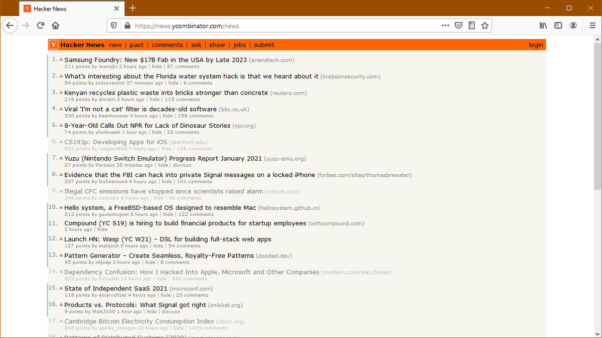

# Seen

A Firefox extension to fade or hide links that you have already seen.

You can quickly identify new links since your previous visit and hide old links with a single click.

## Usage

1. Navigate to a supported site.
2. Click on the seen action button (located inside the address bar)
3. You can grant the permission to access data so that the extension is activated automatically on future visits.
Alternatively, you can disable the permission request in the settings and only activate the extension when the action button is pressed.

The action button can be activated with a keyboard shortcut (Alt+Z by default).
You can configure this shortcut by navigating to `about:addons`, click on the gear on the top right and select `Manage Extension Shortcuts`.

You can open the extension's settings by middle-clicking the action button.

## Supported sites:
- reddit.com
- news.ycombinator.com
- lobste.rs

## Privacy policy

The extension stores a list of seen urls locally on your computer. The list is not shared with other parties or uploaded to the internet.
In the future, it might be uploaded to the internet for the purposes of synchronizing the seen urls between different computers, but will be disabled by default.
It is possible to disable this behavior in the extension's options by allowing it to access your browser's history and use that to track seen urls.
